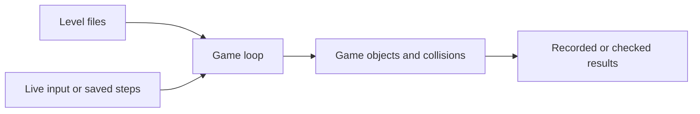

# Donkey Kong — C++ Console Game

**Links:** [Repository](https://github.com/avieladika/Donkey-Kong) · [Source](Code%20Files) · [Original instructions](Game_Instructions.rtf)

An academic Donkey Kong-inspired console game with file-based levels, multiple enemy behaviors, and modes for interactive play, recording, and replay.

## The Challenge

A console game must coordinate movement, collisions, enemies, and progression. Reproducing a game session adds another challenge: inputs, random behavior, and expected results need to be recorded consistently.

## The Solution

The project separates boards, game objects, and game modes into C++ classes. Recording stores input steps and random seeds, while replay uses saved data and can compare game events with expected outcomes.

## What It Includes

- Level loading from `.screen` files.
- Mario, barrels, and multiple ghost behaviors.
- Interactive, save, load, and silent replay modes.
- Recorded input steps and random seeds.
- Result checking for recorded game events.
- Visual Studio solution for the Windows console.

## System Model

`Game*` classes implement game modes; `Board` represents levels; Mario, barrels, and ghosts implement game objects. `Steps` and `Results` store the information used for recording and replay.

## Core Technical Flow

Load level → initialize game objects → process input or replay steps → update collisions/state → record or compare events.

## Why This Design

Game-object classes organize distinct behaviors. Saved steps and outcomes provide a way to inspect repeatable sessions, although replay checking is not a substitute for unit tests.

## Build and run

The project targets the Windows console and includes a Visual Studio solution.

1. Install Visual Studio with the Desktop development with C++ workload.
2. Open `Code Files/Donkey_Kong_AN.sln` and build the application.
3. Set the working directory to `Code Files` so the `.screen`, `.steps`, and `.result` files can be found.
4. Launch the built executable. Use the menu for game instructions and difficulty.

Supported command-line arguments:

| Arguments | Mode |
| --- | --- |
| none | Interactive play |
| `-save` | Record a game |
| `-load` | Replay a recording |
| `-load -silent` | Replay with result checking |

Additional original instructions are in `Game_Instructions.rtf`.

## Scope and credits

Academic game project. Donkey Kong and its characters belong to their respective owners; this repository is an educational implementation. The replay checker is not a general automated unit-test suite. Windows console APIs make portability an additional task.
